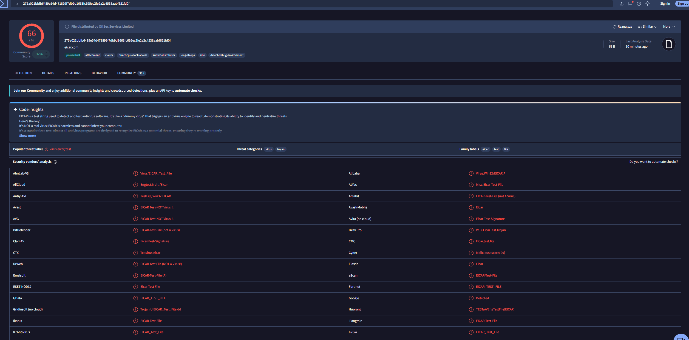

<div align="center">

# 🧬 Static Malware Analysis + OSINT — EICAR Test File


</div>

**Target file:** `eicar.com`
**Related detection write-up:** [malware-detection-eicar.md](malware-detection-eicar.md)

---

## 🎯 Objective

Analyze the EICAR test file using **static analysis** (examining a file without executing it) and cross-reference it against a real threat-intelligence source (VirusTotal), to practice the OSINT/IoC-analysis skills used in threat intel and malware analysis roles — as opposed to the earlier **dynamic analysis** (letting Defender detect it on execution) already documented in [malware-detection-eicar.md](malware-detection-eicar.md).

---

## 🔬 Static Analysis

Static analysis means inspecting a file's properties and content directly — no running it, no sandbox needed. Three basic, free tools/commands cover the fundamentals:

### 1. File type identification

```bash
file eicar.com
```
```
eicar.com: EICAR virus test files
```

`file` identifies files by inspecting their byte structure/header against known signatures — it recognized this as EICAR purely from content inspection, no execution involved.

### 2. Cryptographic hashing

```bash
sha256sum eicar.com
```
```
275a021bbfb6489e54d471899f7db9d1663fc695ec2fe2a2c4538aabf651fd0f  eicar.com
```

A hash is a unique fingerprint of the file's exact contents — this is the single most important artifact for threat intel lookups, since it lets you check a file against threat feeds without ever needing to share or upload the actual file itself.

### 3. Readable string extraction

```bash
strings eicar.com
```
```
X5O!P%@AP[4\PZX54(P^)7CC)7}$EICAR-STANDARD-ANTIVIRUS-TEST-FILE!$H+H*
```

`strings` extracts human-readable text from a binary. Here, it revealed the *entire* file content in plain text — confirming EICAR isn't obfuscated, packed, or encoded in any way. This is a genuinely useful static-analysis habit: `strings` output on real malware often reveals hardcoded IPs, domains, file paths, or error messages that hint at functionality before ever running the sample.

---

## 🌐 OSINT Lookup — VirusTotal

Took the hash from Step 2 and searched it directly on VirusTotal (no file upload needed — hash-only lookup):

```
275a021bbfb6489e54d471899f7db9d1663fc695ec2fe2a2c4538aabf651fd0f
```



### Result: 66 / 68 security vendors flagged this hash

**Popular threat label:** `virus.eicar/test`
**Threat categories:** `virus`, `trojan`

### Key observation — vendor naming is not standardized

Reviewing individual vendor labels for this identical file revealed significant inconsistency:

| Vendor | Label Given |
|---|---|
| Avast / AVG | `EICAR Test-NOT Virus!!!` |
| BitDefender / DrWeb | `EICAR-Test-File (not A Virus)` |
| Gridinsoft | `Trojan.U.EICAR_Test_File.dd` |
| Cynet | `Malicious (score: 99)` — generic score, no EICAR-specific label at all |
| ESET-NOD32 | `Eicar Test File` |

Despite every engine analyzing the **exact same 68-byte file**, naming conventions range from correctly noting "not a virus" to classifying it as a literal Trojan, to giving no descriptive name at all — just a numeric malicious score.

---

## 📋 Findings Summary

1. **Static analysis alone fully identified the file** — no execution was needed to determine what it was, confirming it as a non-obfuscated plain-text signature file
2. **The file's hash is a universally recognized IoC** — a single hash lookup instantly surfaced consensus across 66 independent security vendors
3. **Vendor threat-naming is inconsistent** — a real analyst cannot rely on any single vendor's label as authoritative; aggregated/consensus views (like VirusTotal's detection ratio and popular threat label) are more reliable than any individual engine's naming

## 💡 SOC / CTI Relevance

This exercise demonstrates the foundational OSINT/IoC workflow used in threat intelligence work: **extract an indicator (hash) → check it against external threat feeds → interpret and reconcile inconsistent vendor data → reach a defensible conclusion.** The same workflow applies directly to real incident triage — when an unknown file is found on an endpoint, hashing it and checking OSINT sources like VirusTotal is typically the *first* step, well before deeper dynamic/sandbox analysis is warranted. Recognizing that vendor labels disagree (and knowing to trust aggregated consensus over any single source) is a practical skill that prevents over- or under-reacting to a single engine's classification.
