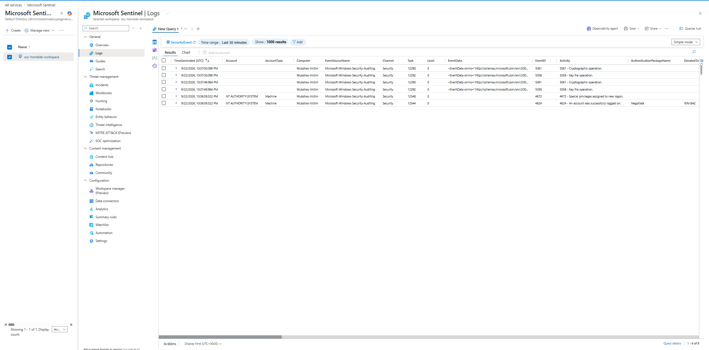

<div align="center">

# ☁️ Azure Sentinel Integration — Cloud SIEM Alongside Wazuh


</div>

---

## 📝 Summary

To gain hands-on experience with a real cloud-native SIEM (a common requirement in PH SOC Tier 1 postings alongside on-prem tools like Wazuh), Windows-Victim was connected to **Microsoft Sentinel** via **Azure Arc** and the **Azure Monitor Agent (AMA)**. This gives the homelab two parallel, independently-operating SIEMs ingesting from the same endpoint — useful for comparing detection coverage, query languages (KQL vs Wazuh rules), and cloud vs on-prem operational models.

---

## ❓ Why Azure Arc was required

Microsoft Sentinel's native VM onboarding flow expects the target machine to already exist as an **Azure resource** (an Azure-hosted VM). Windows-Victim is a local VirtualBox VM with no relationship to Azure, so it never appeared in Sentinel's resource picker by default.

**Azure Arc** solves this: it's Microsoft's hybrid/multicloud management layer that lets any machine — on-prem, in a VM, in another cloud — register itself as a manageable Azure resource without actually living in Azure. Once Arc-registered, a machine becomes eligible for the same agent-based data collection (AMA) that native Azure VMs use.

---

## 🚀 Setup Steps

### 1. Resource group + Log Analytics workspace

**Azure Portal:**
- Created resource group `soc-homelab-rg` (Southeast Asia)
- Created Log Analytics workspace `soc-homelab-workspace` in that resource group
- First workspace creation attempt silently failed (no error shown, workspace never appeared) — recreated with the same settings and it succeeded the second time on the Review + Create validation screen

### 2. Enable Microsoft Sentinel

- Microsoft Sentinel → **Add** → selected `soc-homelab-workspace`
- 31-day Sentinel free trial activated automatically (10 GB/day free ingestion for both Sentinel and Log Analytics during the trial)
- Note: Microsoft is migrating Sentinel's primary interface to the **Defender portal** (`security.microsoft.com`); as of this setup, the classic Azure Portal experience for Sentinel is still available but scheduled for full retirement after March 31, 2027

### 3. Install the Windows Security Events solution

- Sentinel → **Content hub** → searched "Windows Security Events" → **Install**
- This makes the "Windows Security Events via AMA" data connector available under **Data connectors**

### 4. Register Windows-Victim with Azure Arc

**Azure Portal**, Servers - Azure Arc → **Add a single server**:
- Subscription: existing subscription
- Resource group: `soc-homelab-rg`
- Region: Southeast Asia
- OS: Windows
- Authentication method: **Authenticate machines manually**
- Clicked **Download and run script** to generate a PowerShell onboarding script

**On Windows-Victim**, PowerShell (Administrator):

```powershell
Set-ExecutionPolicy -ExecutionPolicy Bypass -Scope Process -Force
C:\OnboardingScript.ps1
```

The script:
- Downloads and installs the Azure Connected Machine Agent
- Prompts an interactive Microsoft sign-in (device/browser-based auth) to link the machine to the Azure subscription
- Registers the machine as an `Microsoft.HybridCompute/machines` resource

**Verification:**

```powershell
& "$env:ProgramW6432\AzureConnectedMachineAgent\azcmagent.exe" show
```

Confirmed:
```
Resource Name        : Wubdiws-Victim
Agent Status          : Connected
Agent Last Heartbeat  : (live timestamp)
```

### 5. Create the Data Collection Rule (DCR)

Sentinel → **Data connectors** → **Windows Security Events via AMA** → **Open connector page** → **Create data collection rule**:
- Rule name: `windows-victim-dcr`
- Resources: added `Wubdiws-Victim` (now selectable, since Arc registration made it a valid Azure resource)
- Data to collect: All Security Events

Azure automatically installs the AMA extension onto Arc-registered machines once they're added to a DCR — no manual agent install step was needed beyond Arc itself.

### 6. Verify data flow

Sentinel → **Logs**, query:

```kql
SecurityEvent
| take 10
```

Confirmed live results within ~10 minutes of DCR creation, including:
- Event ID `4624` — successful logon
- Event ID `4672` — special privileges assigned to new logon
- Event ID `5061` / `5058` — cryptographic/key file operations



---

## 🐞 Troubleshooting Encountered

| Issue | Cause | Resolution |
|---|---|---|
| Free trial signup blocked ("already have an Azure account") | An "Azure Plan" subscription already existed on the account from a prior sign-in, separate from the dedicated 30-day/$200-credit trial | Used the existing Pay-As-You-Go-style subscription directly; confirmed $0 cost, free-tier allowances still apply |
| Log Analytics workspace creation silently failed | Unclear — possible transient portal issue | Recreated identically; second attempt passed validation and deployed successfully |
| Sentinel "Add" button unresponsive in workspace picker | Portal UI rendering issue | Resolved via hard refresh (`Ctrl+Shift+R`) |
| `AADSTS500200` — "personal Microsoft accounts are not supported" | Defender portal (`security.microsoft.com`), which Sentinel now redirects to, restricts some pages to organizational (work/school) accounts; this lab uses a personal Gmail-linked Microsoft account | Accessed Content Hub via a direct deep link, which succeeded despite the account type; remainder of setup completed from the classic Azure Portal Sentinel experience to avoid the restriction entirely |
| Windows-Victim not appearing in Sentinel's DCR resource picker | Sentinel only lists actual Azure resources; a local VirtualBox VM has no Azure presence by default | Registered the VM with Azure Arc first (see Step 4), which creates the required Azure-side resource representation |

---

## 💡 SOC Relevance

- **Hybrid/multicloud visibility is a real operational pattern**, not just a homelab workaround — many organizations run on-prem infrastructure (like this lab's VirtualBox VMs) alongside cloud workloads, and Azure Arc is Microsoft's actual production mechanism for bringing non-Azure machines under centralized security monitoring. This setup mirrors that real-world architecture rather than being an artificial lab-only trick.
- **Running two SIEMs against the same endpoint** (Wazuh + Sentinel) enables direct comparison of detection rule logic, query languages (Wazuh's XML rule engine vs Sentinel's KQL), and alerting philosophy — valuable for demonstrating SIEM-agnostic analyst skills rather than single-tool familiarity.
- **Platform migrations affect operational continuity.** Encountering Sentinel's account-type restriction and its Defender-portal migration firsthand is a realistic preview of the kind of platform-shift friction SOC teams deal with when vendors change their product architecture mid-deployment.
